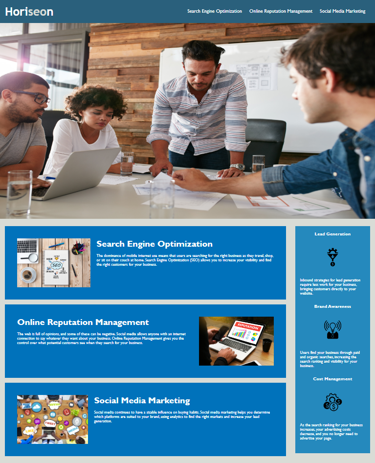

# Horiseon Webpage

## Description

To make the Horiseon webpage is the first challenge in the bootcamp. It was a great opportunity to use all the knowlegde I aquired in the first week of basics of HTML and CSS. 

## Installation

N/A

## Usage

To view and use the Horiseon webpage you can click on a link bellow. It will provide you with basic information about the company.

SonjaGorin.github.io/Challenge-01

To preview the Horiseon Webpage click on the link bellow.

## Credits

N/A

## License

Please refer to the LICENSE in the repo.
